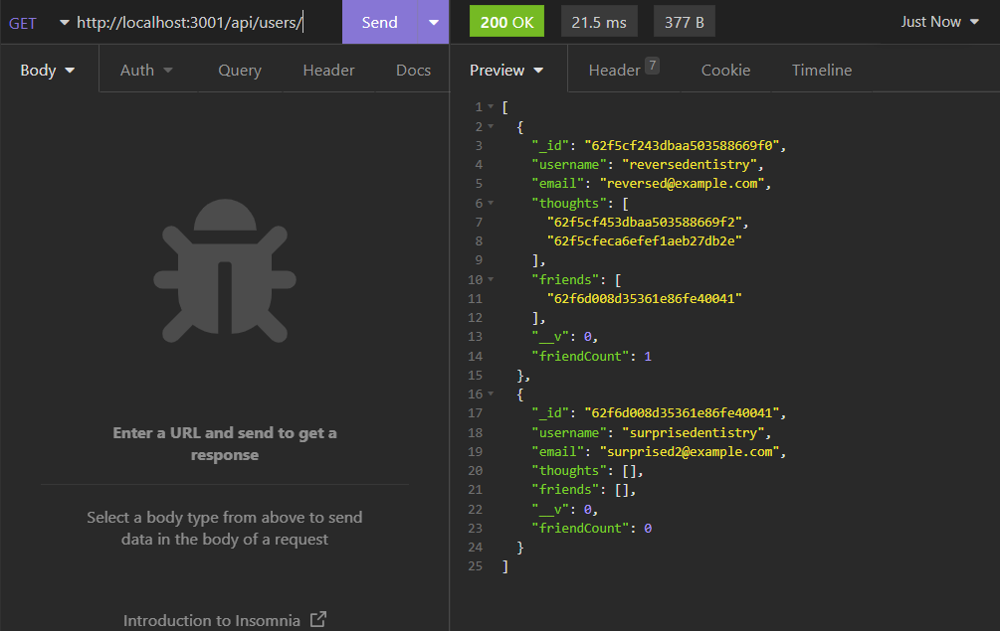
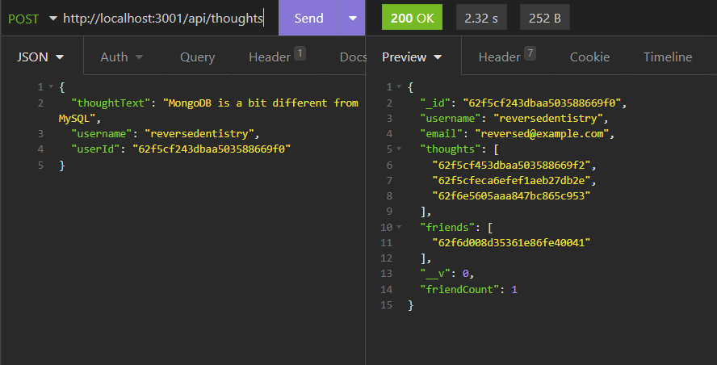

# Building a Backend Social Media API Using MongoDB

## Description 
MongoDB is a NoSQL database which are often the tool of choice for social media companies for their backends. This project aims to simulate the backend API of a social media site using MongoDB, with functions executed through an API client, in this case the Insomnia API client. Mongoose, an equivalent to Sequelize for SQL databases, is used for easier object modeling when working with MongoDB to build the databases and documents within the database. 

### Technologies
- Node.js
- Express.js
- MongoDB
- Mongoose
- Insomnia API client
- Moment.js

## Installation Instructions 
```
npm i
```

## Usage Instructions
Initialize the server in the terminal. Use the API client to make new users, thoughts, and reactions to thoughts, edit and delete these, as well as add existing users to a user's friend list. Before thoughts and reactions can be made, a user must be entered within the database. To create a new user, use this format in JSON under the URL of "http://localhost:3001/api/users" as a POST route.  
```
{
    "username": "[example username]"
    "email": "[example email]"
}
```
You can then view, edit, or delete a user using the same URL specified above and then appended with the ID of the specific user with a GET, PUT, and DELETE route, respectively. 

When using a PUT route, enter the properties you want to change: 
```
{
    "username": "[edited username]",
    "email": "[edited email]"
}
```
You do not need to enter properties that you are not changing.

To add or delete users to a user's friend list, make a POST or DELETE request directly with the URL: "http://localhost:3001/api/users/:userId/friends/:friendId" with the friendId being the specific ID of the user you want to add as a friend. No JSON body is needed. 

Once a user is entered, use their unique ID to make a POST route for a new thought registered under that user with the URL "http://localhost:3001/api/thoughts": 
```
{
    "thoughtText": "[example text]",
    "username": "[user's username]",
    "userId": "[user's ID]"
}
```
This will return the user with an array of IDs of the thoughts they've made. To view, edit, or delete a thought, make a GET, PUT, or DELETE request using the same URL as above appended with the thought's specific ID. Similarly to updating a user's info, there is no need to enter fields for properties you are not intending to change. 

To enter a reaction for a specific thought, use the URL "http://localhost:3001/api/thoughts/:thoughtId/reactions" and make a POST route. In the JSON body, enter these properties: 
```
{
    "reactionBody": "[example text]",
    "username": "[user's username]"
}
```
This will return the specified thought with an array of IDs for its reactions. 

To delete a reaction, use the URL above but appended with the ID of the chosen reaction and make a DELETE request. 

PUT requests cannot be made for reactions. 

[Click here for a demo video.](https://youtu.be/AX4TUhg7VgE)

### Screenshots




## License
This project is MIT licensed. 

## Contact
- [GitHub](https://github.com/reversedentistry)
- Email: sherylhu@proton.me

